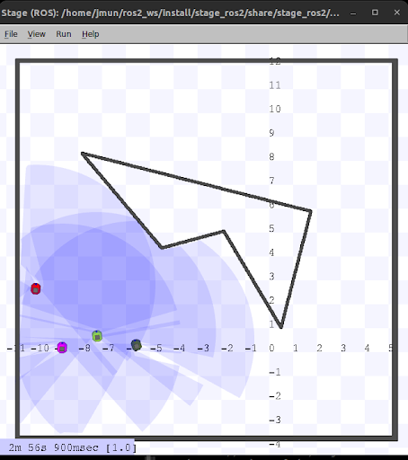

# Potential Field Swarm (ROS2)

## Overview
This project implements a **swarm robotics simulation** in ROS2 where robots coordinate using potential field methods. The system supports both **leader** and **follower** behaviors:
- The **leader** performs a random walk while avoiding obstacles.
- The **followers** use attractive and repulsive forces to maintain safe distances and move toward the leader.

## Goal
The main goal of this project is to:
- Demonstrate **swarm coordination** using potential field algorithms.

## Howw It Works
- **Leader Behavior**:
  - Publishes its pose to a shared topic (`leader_odom`).
  - Moves forward until an obstacle is detected, then rotates randomly to avoid it.
- **Follower Behavior**:
  - Subscribes to the leader’s pose.
  - Computes attractive forces toward the leader and repulsive forces away from obstacles.
  - Adds a random force if the robot is stuck to help escape local minima.
- **ROS2 Integration**:
  - Uses `rclpy` for node creation and spinning.
  - Publishes velocity commands (`cmd_vel`) and subscribes to laser scans and odometry.
  - Implements potential field equations for swarm navigation.



## Usage
1. Build your ROS2 workspace:
   ```bash
   colcon build
   source install/setup.bash
2. Launch Stage with cave multi world
   ```bash
   ros2 launch stage_ros2 demo.launch.py world:=cave_multi
3. In separate terminal run a leader robot:
   ```bash
   ros2 run swarm swarm robot_0 true
4. In separate terminal run a follower robot:
   ```bash
   ros2 run swarm swarm robot_1 false
